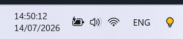

<p align="center">
  
</p>

<h1 align="center">KeyGlow Keeper</h1>

<p align="center">
  A quiet Windows tray utility that keeps the keyboard backlight on for compatible Lenovo laptops.<br>
  כלי שקט ל-Windows השומר על תאורת המקלדת דולקת במחשבי Lenovo תואמים.
</p>

<p align="center">
  <a href="https://github.com/Banditor/keyglow-keeper/releases/latest"><strong>Download the latest release · הורדת הגרסה האחרונה</strong></a>
</p>



## English

Some Lenovo laptops turn their keyboard backlight off automatically and do not expose an "always on" setting. KeyGlow Keeper uses the locally installed Lenovo Vantage Service to monitor the backlight and restore it when needed.

### Features

- Keeps the keyboard backlight on without simulating key presses.
- Quiet operation: no pop-up or balloon notifications.
- Starts automatically with Windows and remembers your choice.
- Left-click the tray icon to toggle the keeper on or off.
- Right-click for on/off, startup, and GitHub options.
- Low/high selection appears only when the Lenovo controller reports two real brightness levels.
- English and Hebrew interface, selected from the Windows display language.
- No administrator rights, network access, telemetry, or Windows shell patching.

### Compatibility

- Windows 10 or Windows 11 with .NET Framework 4.8.
- A compatible Lenovo consumer laptop with a backlit keyboard.
- Lenovo Vantage Service with the `IdeaNotebookAddin` hardware interface installed.

Compatibility depends on Lenovo's model-specific firmware and driver support. Unsupported computers are not modified. KeyGlow Keeper does not add a custom tile to Windows Quick Settings because Windows does not provide a supported extension API for third-party tiles.

### Install

1. Open the [latest release](https://github.com/Banditor/keyglow-keeper/releases/latest).
2. Download `KeyGlowKeeper-v1.0.0.zip` and extract it.
3. Run `Install.cmd`.
4. Find the KeyGlow Keeper icon in the notification area. Windows may initially place it under the `^` hidden-icons menu.

To remove the utility, run `Uninstall.cmd` from the extracted release folder.

> [!NOTE]
> The downloadable executable is not code-signed, so Microsoft SmartScreen may display an unknown-publisher warning. Verify the SHA-256 checksum attached to the release, or build the executable from the public source code.

### Build from source

Open Windows PowerShell in the repository and run:

```powershell
.\build.ps1
```

The build uses the .NET Framework C# compiler included with Windows and writes release files to `dist`.

## עברית

בחלק ממחשבי Lenovo תאורת המקלדת נכבית אוטומטית ואין הגדרה מובנית של „תמיד דולקת”. KeyGlow Keeper משתמש בשירות Lenovo Vantage המותקן במחשב, בודק את מצב התאורה ומדליק אותה מחדש בעת הצורך.

### תכונות

- משאיר את תאורת המקלדת דולקת ללא הדמיית לחיצות מקשים.
- פעולה שקטה לחלוטין, ללא התראות קופצות.
- מופעל אוטומטית עם Windows וזוכר את הבחירה האחרונה.
- לחיצה שמאלית על הסמל מפעילה או מכבה את השמירה.
- לחיצה ימנית פותחת אפשרויות הפעלה, אתחול ועמוד GitHub.
- בחירת עוצמה נמוכה או גבוהה מוצגת רק כאשר בקר Lenovo מדווח על שתי דרגות חומרה אמיתיות.
- ממשק באנגלית או בעברית בהתאם לשפת התצוגה של Windows.
- ללא הרשאות מנהל, אינטרנט, איסוף נתונים או שינוי של ממשק Windows.

### תאימות

- Windows 10 או Windows 11 עם ‎.NET Framework 4.8‎.
- מחשב Lenovo תואם הכולל מקלדת מוארת.
- שירות Lenovo Vantage עם ממשק החומרה `IdeaNotebookAddin`.

התאימות תלויה בקושחה ובמנהלי ההתקנים של כל דגם. במחשב שאינו נתמך לא מתבצע שינוי. התוכנה אינה מוסיפה אריח לחלונית ההגדרות המהירות של Windows, משום שאין ב-Windows ממשק הרחבה רשמי לאריחים חיצוניים.

### התקנה

1. פתח את [עמוד הגרסה האחרונה](https://github.com/Banditor/keyglow-keeper/releases/latest).
2. הורד את `KeyGlowKeeper-v1.0.0.zip` וחלץ אותו.
3. הפעל את `Install.cmd`.
4. סמל התוכנה יופיע באזור סמלי המערכת, ולעיתים תחילה תחת החץ `^`.

להסרה, הפעל את `Uninstall.cmd` מתוך תיקיית הגרסה שחולצה.

> [!NOTE]
> קובץ ההפעלה אינו חתום בחתימה מסחרית, ולכן Microsoft SmartScreen עשוי להציג אזהרת מפרסם לא מוכר. ניתן לאמת את ערך ה-SHA-256 המצורף לגרסה או לבנות את הקובץ ישירות מקוד המקור הפתוח.

## Privacy and security · פרטיות ואבטחה

KeyGlow Keeper runs locally, does not contact external servers, and stores only its enabled/startup/brightness preferences under the current user's registry hive. The app is open source so its behavior can be reviewed.

התוכנה פועלת מקומית בלבד, אינה מתקשרת עם שרתים חיצוניים ושומרת רק את הגדרות ההפעלה והעוצמה תחת חשבון המשתמש הנוכחי. הקוד פתוח וניתן לבדיקה.

## License

MIT. This project is not affiliated with or endorsed by Lenovo. Lenovo and Lenovo Vantage are trademarks of their respective owner.
